>**Note:**
>This Readme has been automatically created by [zepppelin2md.py](https://github.com/bernhard-42/zeppelin2md).

>Alternatively, load into your Zeppelin instance using the URL 
>    `https://raw.githubusercontent.com/bernhard-42/zeppelin-visualizations/master/notebooks/Zeppelin-Nvd3-Demo.json`

# notebooks/Zeppelin-Nvd3-Demo.json

---

#### Check Versions

_Input:_

```python
%pyspark

def versionCheck():
    import sys
    print("Python: " + sys.version.replace("\n", " - "))
    print("Spark:  " + sc.version)

def display(html, style=None):
    print("%angular")
    if isinstance(html, (tuple, list)):
        html = "".join(["""<div style="display:inline; margin-left:%dpx">%s</div>""" % (el[1], el[0]) for el in html])
    if style is not None:
        html = "<%s>%s</%s>" % (style, html, style)
    print(html)

def getNoteId():
    return z.z.getInterpreterContext().getNoteId()

def getParagraphId():
    return z.z.getInterpreterContext().getParagraphId()


# The variable z holds the zeppelinContext. It is essential for all Angular based interactions - so let's save it :-)
ZEPPELIN_CONTEXT = z.z

# In case one overwrites z, z = recoverZeppelinContext() gets the context back
def recoverZeppelinContext():
    return PyZeppelinContext(ZEPPELIN_CONTEXT)

versionCheck()
```


_Result:_

```
Python: 3.5.2 |Anaconda 4.3.0 (x86_64)| (default, Jul  2 2016, 17:52:12)  - [GCC 4.2.1 Compatible Apple LLVM 4.2 (clang-425.0.28)]
Spark:  2.1.0

```

---

#### Some helpers to create data

_Input:_

```python
%pyspark

import numpy as np
import pandas as pd
import random
import time
from datetime import datetime

pd.options.display.width=200

def randomList(count, mean, dist):
    return [ mean + (1 if random.random() > 0.5 else -1) * random.random() * dist for i in range(count)]


def randomNormalList(count, mean, stdev):
    return np.random.normal(mean, stdev, count).tolist()


def randomWalk(count=20, factor=2, offset=10):
    return np.abs(np.cumsum(np.random.uniform(-factor, factor, (count, 1)) ) + offset)


def lastDays(days, epoch=True, ms=True):
    now = datetime.now()
    t = int(time.mktime(now.timetuple())) - 3600 * 24 * days
    if epoch:
        factor = 1000 if ms else 1
        return [int(t + i * 3600 * 24) * factor for i in range(days)]
    else:
        return [time.strftime('%Y-%m-%d', time.localtime(int(t + i*3600*24))) for i in range(days)]
        
```


---

#### Stock data loader

_Input:_

```python
%pyspark

#
# pip install yahoo-finance
#

from yahoo_finance import Share     

def downloadHistoricalStockData(symbol, begin, end, fillMissing=True):
    data = Share(symbol).get_historical("%04d-%02d-%02d" % begin, "%04d-%02d-%02d" % end)
    df = pd.DataFrame(data)

    for col in "Adj_Close", "Close", "High", "Low", "Open":
        df[col] = df[col].astype(float)
    df["Volume"] = df["Volume"].astype(int)
    df["Date"] = pd.to_datetime(df["Date"], infer_datetime_format=True)
    
    if fillMissing:
        return fillMissingValues(df, symbol, begin, end)
    else: 
        return df

def fillMissingValues(df, symbol, begin, end):
    allDates = pd.DataFrame({"Date": pd.date_range(pd.datetime(*begin), pd.datetime(*end), freq='D')})
    df2 = allDates.merge(df, how="outer")
    df2["Symbol"] = symbol
    df2 = df.fillna(0, axis=1)
    df2["Timestamp"] = (df["Date"].astype("int64") / 1000000).astype('int64')
    return df2.sort_values(by=["Timestamp"])
```


---

#### Iris data download ...

_Input:_

```bash
%sh
cd /tmp
wget  https://raw.github.com/pydata/pandas/master/pandas/tests/data/iris.csv
```


---

#### ... and as pandas  DataFrame

_Input:_

```python
%pyspark

import pandas as pd
iris = pd.read_csv('/tmp/iris.csv')
irisAttributes = ["SepalLength", "SepalWidth", "PetalLength", "PetalWidth"]
print(iris.head())
```


---

## 1 Preparation


---

#### Initialize ZeppelinSession ...

_Input:_

```python
%pyspark

from zeppelin_session import ZeppelinSession, resetZeppelinSession, LogLevel, Logger

resetZeppelinSession(z.z)

zs = ZeppelinSession(z.z)
```


_Result:_

```
Resetting ZeppelinSession

```

---

#### ... and start it in the next paragraph

_Input:_

```python
%pyspark

zs.start()
```


---

#### Initialize NVD3

_Input:_

```python
%pyspark

from zeppelin_viz.nvd3 import Nvd3
from zeppelin_viz.nvd3.nvd3_chart import Nvd3Chart

nv = Nvd3()
```


---

#### Recommend to load NVD3 1.8.5 (this might break some %sql functionality)

_Input:_

```python
%pyspark
nv.reloadNVD3("1.8.5")
```


---

# 1 Included Charts

## 1.1 Box Plot Chart


---


_Input:_

```python
%pyspark
iris.head()
```


_Result:_

```
   SepalLength  SepalWidth  PetalLength  PetalWidth         Name    color  strokeWidth
0          5.1         3.5          1.4         0.2  Iris-setosa  #1f77b4          0.5
1          4.9         3.0          1.4         0.2  Iris-setosa  #1f77b4          0.5
2          4.7         3.2          1.3         0.2  Iris-setosa  #1f77b4          0.5
3          4.6         3.1          1.5         0.2  Iris-setosa  #1f77b4          0.5
4          5.0         3.6          1.4         0.2  Iris-setosa  #1f77b4          0.5

```

---

#### Compare the three species (IQR box plot)

_Input:_

```python
%pyspark
#!zeppelin2md:images/boxPlotChart-03.png

bp1 = nv.boxPlotChart()

config={"height": 400, "width":450, "color":nv.c10(),
        "yDomain": [-0.5, 8.5], "maxBoxWidth":False }

def getSpecies(name):
    return iris[iris.Name==name].loc[:,iris.columns != 'Name']

setosa     = bp1.convert(data=getSpecies("Iris-setosa"    ), boxStyle="iqr")
versicolor = bp1.convert(data=getSpecies("Iris-versicolor"), boxStyle="iqr")
virginica  = bp1.convert(data=getSpecies("Iris-virginica" ), boxStyle="iqr")
         
display(html=[("Iris-setosa", 40),("Iris-versicolor", 330),("Iris-virginica", 300)], style="h3")

bp1.plot([
    {"data":setosa,     "config":config},
    {"data":versicolor, "config":config},
    {"data":virginica,  "config":config}
])
```


_Result:_

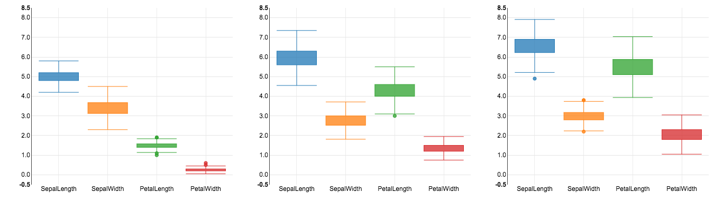

---

#### Compare IQR and Min-Max box plot

_Input:_

```python
%pyspark
#!zeppelin2md:images/boxPlotChart-04.png

bp2 = nv.boxPlotChart()

config={"height": 400, "width":450, "color":nv.c10(),
        "yDomain": [-0.5, 6], "maxBoxWidth":False }

display(html=[("IQR", 40),("Min-Max", 400)], style="h3")

iqr =    bp2.convert(data=getSpecies("Iris-setosa"), boxStyle="iqr")
minmax = bp2.convert(data=getSpecies("Iris-setosa"), boxStyle="min-max")

bp2.plot([
    {"data":iqr,     "config":config},
    {"data":minmax,  "config":config}
])         
```


_Result:_

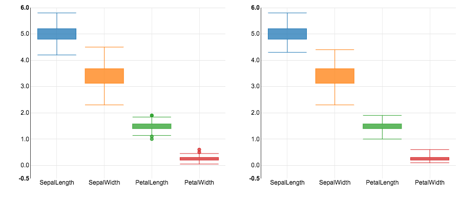

---


## 3.2 Line Chart


---


_Input:_

```python
%pyspark
x = np.linspace(0, 4*np.pi, 100)

l_df = pd.DataFrame({"X":x*1000, "Sin":np.sin(x), "Cos":np.cos(x), "ArcTan":np.arctan(x-2*np.pi)/3})
# l_df = pd.DataFrame({"X":lastDays(100, epoch=True, ms=True),"Sin":np.sin(x), "Cos":np.cos(x), "ArcTan":np.arctan(x-2*np.pi)/3})

l_df.head()
```


---


_Input:_

```python
%pyspark
#!zeppelin2md:images/lineChart-035.png

l1 = nv.lineChart()

config={"height":500, "width": 1024,
        "focusEnable": False, "color":nv.c20b()[10:13], 
        "yAxis": {"axisLabel":"f(x)", "tickFormat":",.2f"}, 
        "xAxis":{"axisLabel":"x", "tickFormat":",.2f"}}
        
lineAttributes={"area":[True, False, True], "fillOpacity":[0.2, 0, 0.2], "style":["dashed", "dotted", None]}

data = l1.convert(data=l_df[:70], key="X", values=["Sin", "Cos", "ArcTan"],lineAttributes=lineAttributes)        

l1.plot({"data":data, "config":config})
```


_Result:_


---

#### Dynamically add values

_Input:_

```python
%pyspark
import time

for i in range(71,100):
    time.sleep(0.1)
    data = l1.convert(data=l_df[i:i+1], key="X", values=["Sin", "Cos", "ArcTan"], lineAttributes=lineAttributes)
    l1.append({"data":data, "config":config})
```


---

#### Add a focus selector 

_Input:_

```python
%pyspark
#!zeppelin2md:images/lineChart-036.png

l2 = nv.lineChart()

config={"height":500, "width": 1024,
        "focusEnable": True, "color":nv.c10(), 
        "yAxis": {"axisLabel":"f(x)", "tickFormat":",.2f"}, 
        "xAxis":{"axisLabel":"x", "tickFormat":"%d-%m-%Y"}}

lineAttributes={"area":[True, False, True], "fillOpacity":[0.2, 0, 0.2], "style":["dashed", "dotted", None]}
data = l2.convert(l_df, "X", ["Sin", "Cos", "ArcTan"],lineAttributes=lineAttributes) 

l2.plot({"data":data, "config":config})
```


_Result:_


---


## 3.3 Discrete Bar Chart


---


_Input:_

```python
%pyspark
#!zeppelin2md:images/discreteBarChart-037.png

db_df = pd.DataFrame(iris.loc[:, iris.columns != "Name"].mean()).reset_index()
db_df.columns = ["Series", "Mean"]

db = nv.discreteBarChart()

config={"height": 350, "width": 500, "color": nv.c20(), "staggerLabels": False}

data = db.convert(db_df, key="Series", value="Mean")

db.plot({"data":data, "config":config})
```


_Result:_

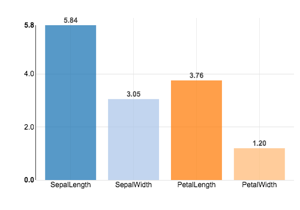

---


## 3.4 Multi Bar Chart


---


_Input:_

```python
%pyspark
#!zeppelin2md:images/multiBarChart-038.png

x = np.linspace(0, 4*np.pi, 10)
mb_df = pd.DataFrame({"X":x, "Sin":np.sin(x), "Cos":np.cos(x), "ArcTan":np.arctan(x-2*np.pi)/3})

mb1 = nv.multiBarChart()

config = {"height":500, "width": 800, 
          "color": nv.c20(),
          "xAxis":{"axisLabel":"x", "tickFormat":",.2f"},
          "yAxis":{"axisLabel":"f(x)", "tickFormat":",.2f"}}

data = mb1.convert(mb_df[:6], "X", ["Sin", "Cos", "ArcTan"])

mb1.plot({"data":data, "config":config})
```


_Result:_

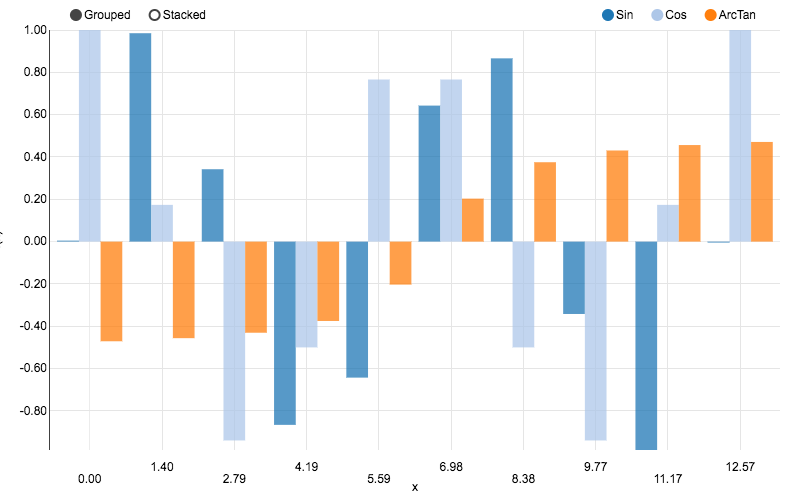

---


_Input:_

```python
%pyspark

for i in range(6,10):
    time.sleep(0.5)
    data = mb1.convert(mb_df[i:i+1], "X", ["Sin", "Cos", "ArcTan"])
    mb1.append({"data":data, "config":config})
    
```


---

## 3.5 Multi Bar Horizontal Chart


---


_Input:_

```python
%pyspark
#!zeppelin2md:images/multiBarHorizontalChart-039.png

mbh = nv.multiBarHorizontalChart()

config = {"height":500, "width": 800, "color":nv.c20()[10:], "stacked":False}

data = mbh.convert(mb_df, "X", ["Sin", "Cos", "ArcTan"])

mbh.plot({"data":data,"config":config})
```


_Result:_

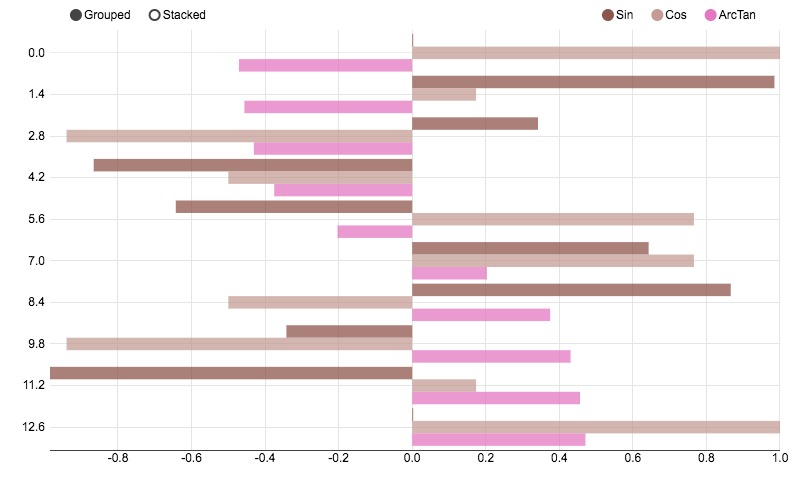

---


## 3.6 Line Plus Bar Chart


---

#### Load HDP historical Stock data

_Input:_

```python
%pyspark

hdp = downloadHistoricalStockData('HDP', (2016,3,18), (2017,3,18))
hdp.head(5)
```


---


_Input:_

```python
%pyspark
#!zeppelin2md:images/linePlusBarChart-040.png

count = 100
quantity = randomWalk(500, 20, 100)
price = randomWalk(500, 2, 20)
date = lastDays(500)

lpb_df = pd.DataFrame({"Date":date, "Quantity":quantity, "Price":price})

lpb = nv.linePlusBarChart()

config={"color":[nv.c20()[0], nv.c20()[3]], 
        "height":600, "width":1200,
        "xAxis":{"tickFormat":"%d.%m.%y"},
        "x2Axis":{"tickFormat":"%d.%m.%y"}
}

data = lpb.convert(hdp, "Timestamp", lineValue="Close", barValue="Volume")

lpb.plot({"data":data,"config":config})
```


_Result:_

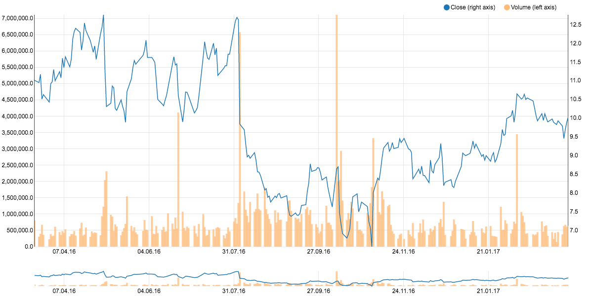

---


## 3.7 Pie Chart


---


_Input:_

```python
%pyspark
#!zeppelin2md:images/pieChart-04.png

p = nv.pieChart()

config1={"donut": False,                  "color": nv.c10(),  "width": 300, "height":400}
config2={"donut": True,                   "color": nv.c20(),  "width": 300, "height":400}
config3={"donut": True,  "halfPie": True, "color": nv.c20b(), "width": 300, "height":400}

data = p.convert(db_df, "Series", "Mean")

p.plot([{"data":data,"config":config1},
        {"data":data,"config":config2},
        {"data":data,"config":config3}])
```


_Result:_

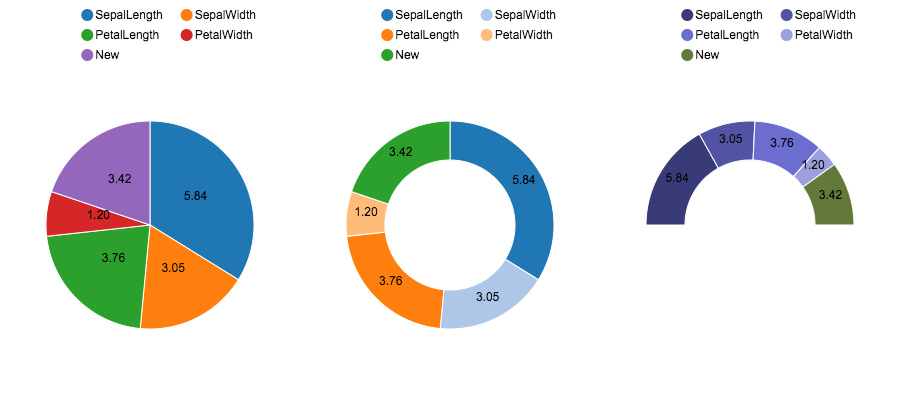

---


_Input:_

```python
%pyspark

config = [config1, config2, config3]

for chart in range(3):
    data = p.convert(pd.DataFrame([{"Series":"New", "Mean":3.42}]), "Series", "Mean")
    p.append({"data":data,"config":config[chart]}, chart=chart)
    
```


---


## 3.8 Stacked Area Chart


---


_Input:_

```python
%pyspark
#!zeppelin2md:images/stackedAreaChart-044.png

import time
from datetime import datetime

count = 100
groups = 5

series = []
for i in range(groups):
    factor = np.random.randint(5,10)
    offset = np.random.randint(20,100)
    series.append(randomWalk(count, 20, offset).tolist())

sa_df = pd.DataFrame([lastDays(count, epoch=True)] + series).T
sa_df.columns = ["Date"] + ["Series %d" % i  for i in range(groups)]


sa = nv.stackedAreaChart()

config={"color": nv.c20(), "height":500}
data = sa.convert(sa_df, "Date", ["Series %d" % i for i in range(groups)])

sa.plot({"data":data,"config":config})
```


_Result:_

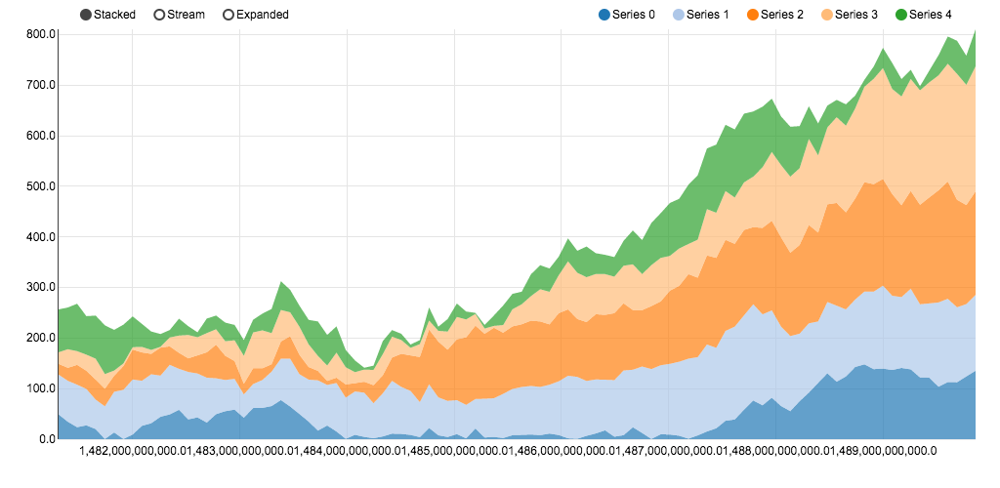

---


## 3.9 Scatter Plus Line Chart


---


_Input:_

```python
%pyspark
from sklearn import linear_model

setosa     = iris[iris.Name == "Iris-setosa"]
versicolor = iris[iris.Name == "Iris-versicolor"]
virginica  = iris[iris.Name == "Iris-virginica"]

def linReg(x,y):
    regr = linear_model.LinearRegression()
    regr.fit(x,y)
    return (regr.coef_.item(0), regr.intercept_.item(0))
    
def prepare(df, name):
    sepal = df.loc[:,["SepalLength", "SepalWidth"]]
    sepal.columns = ["X", name]
    sepal["Shape"] = "diamond"
    petal = df.loc[:,["PetalLength", "PetalWidth"]]
    petal.columns = ["X", name]
    petal["Shape"] = "square"
    
    df = pd.concat([sepal, petal])
    x = df["X"].values.reshape(df.shape[0], 1)
    y = df[name].values.reshape(df.shape[0], 1)
    slope, intercept = linReg(x,y)

    df["Size"] = 2
    df = df.groupby(["Shape", "X", name]).sum().reset_index()
    return (df, slope, intercept)

setosaDf,     setosaSlope,     setosaIntercept     = prepare(setosa,     "Setosa")
virginicaDf,  virginicaSlope,  virginicaIntercept  = prepare(virginica,  "Virginica")
versicolorDf, versicolorSlope, versicolorIntercept = prepare(versicolor, "Versicolor")
```


---


_Input:_

```python
%pyspark
#!zeppelin2md:images/scatterPlusLineChart-045.png

spl = nv.scatterPlusLineChart()

config = {"height":700, "xDomain":[0,8.5], "yDomain":[0,4.6],
          "xAxis":{"axisLabel":"Length (sepal=diamond, petal=square)"}, "yAxis":{"axisLabel":"Width (sepal=diamond, petal=square)"}
}

data = spl.convert(data=[{ "data":setosaDf, "keys":"X", "values":"Setosa", 
                           "lines":{"slope":setosaSlope, "intercept":setosaIntercept}, 
                           "pointAttributes":{"shapes":"Shape",  "sizes":"Size"} },
                           
                         { "data":virginicaDf, "keys":"X", "values":"Virginica", 
                           "lines":{"slope":virginicaSlope, "intercept":virginicaIntercept}, 
                           "pointAttributes":{"shapes":"Shape", "sizes":"Size"} },
                           
                         { "data":versicolorDf, "keys":"X", "values":"Versicolor", 
                           "lines":{"slope":versicolorSlope, "intercept":versicolorIntercept}, 
                           "pointAttributes":{"shapes":"Shape", "sizes":"Size"} }
                           ])
                           
spl.plot({"data":data, "config":config})
```


_Result:_

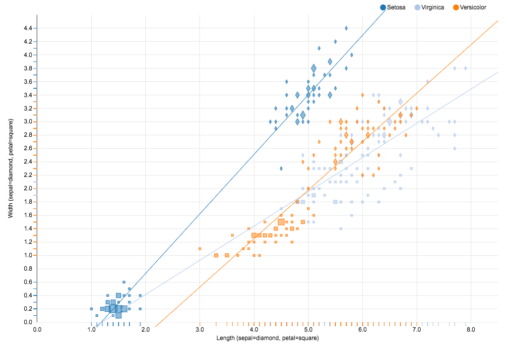

---


## 3.10 Parallel Coordinates Plot


---


_Input:_

```python
%pyspark
iris.loc[iris.Name=="Iris-setosa",     "color"] = nv.c10()[0]
iris.loc[iris.Name=="Iris-versicolor", "color"] = nv.c10()[1]
iris.loc[iris.Name=="Iris-virginica",  "color"] = nv.c10()[2]
iris["strokeWidth"] = 0.5
iris.head()
```


---


_Input:_

```python
%pyspark
#!zeppelin2md:images/parallelCoordinatesChart-046.png

pc = nv.parallelCoordinatesChart()

config = {"height": 600}

data, dim = pc.convert(iris, 'Name', ['SepalLength', 'SepalWidth', 'PetalLength', 'PetalWidth'],
                       lineAttributes=["color", "strokeWidth"], 
                       dimAttributes= {"format": [",.1f", ",.1f", ",.1f", ",.1f"]})
                       
pc.plot({"data":data, "dim":dim, "config":config})    
```


_Result:_

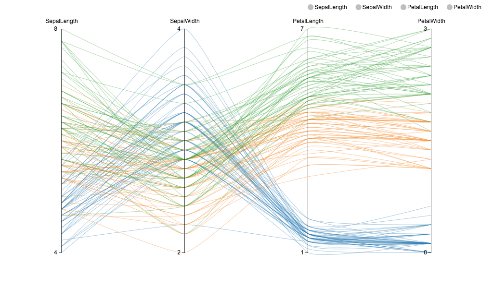

---

## 3.11 Historical Bar Chart


---


_Input:_

```python
%pyspark
#!zeppelin2md:images/historicalBarChart-047.png

hb = nv.historicalBarChart()
hdp["VolumeMio"] = hdp["Volume"] / 10000000

config = {"color":nv.c20()[4:],
          "xAxis":{"axisLabel":"Date (d.m.y)"},
          "yAxis":{"axisLabel":"Volume (Mio)", "tickFormat":",.2f"}}

data = hb.convert(hdp, key="Timestamp", value="VolumeMio")

hb.plot({"data":data, "dim":dim, "config":config})
```


_Result:_

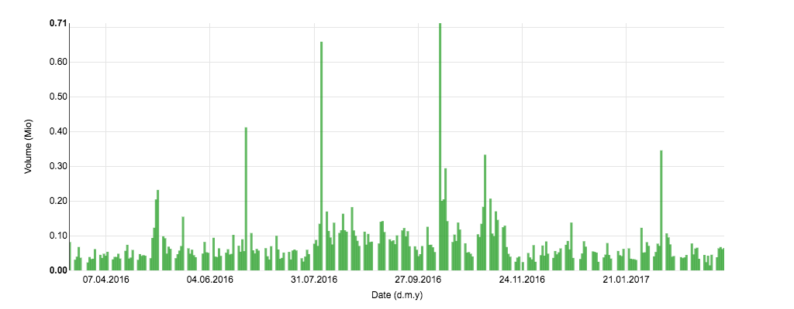

---

## 3.12 Candlestick Chart


---


_Input:_

```python
%pyspark
#!zeppelin2md:images/candlestickBarChart-048.png

cs = nv.candlestickBarChart()

ohlcAttribs = {"open":"Open" ,"high":"High" ,"low":"Low" ,"volume":"Volume" ,"adjusted":"Adj_Close"}
data = cs.convert(hdp[-90:], "Timestamp", "Close", ohlcAttribs)

config = {"color":nv.c10(), "yDomain":[7,12], "width":1400, "height":800,
          "xAxis":{"tickFormat":"%d/%m/%Y", "axisLabel":"Date (d/m/y)"},
          "yAxis":{"axisLabel":"Close (USD)"}}

cs.plot({"data":data, "config":config})
```


_Result:_

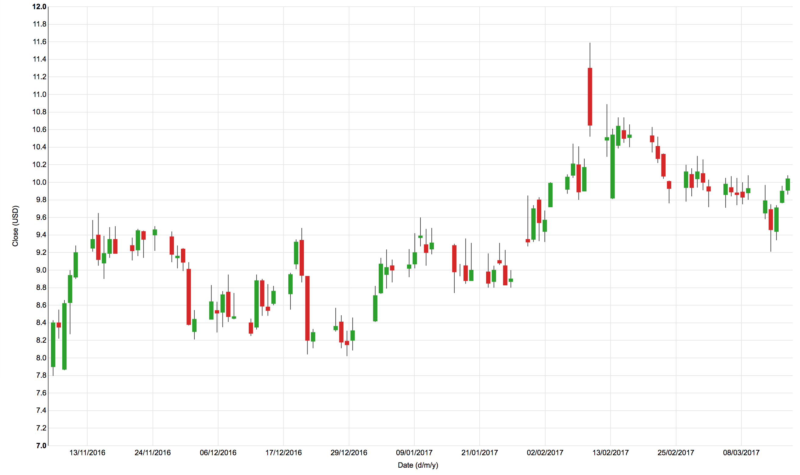

---

## 3.13 OHLC Chart


---


_Input:_

```python
%pyspark
#!zeppelin2md:images/ohlcBarChart-049.png

ohlc = nv.ohlcBarChart()

ohlcAttribs = {"open":"Open" ,"high":"High" ,"low":"Low" ,"volume":"Volume" ,"adjusted":"Adj_Close"}
data = ohlc.convert(hdp[-90:], "Timestamp", "Close", ohlcAttribs)

config = {"color":nv.c20(), "yDomain":[7,12], "width":1400, "height":800,
          "xAxis":{"tickFormat":"%d/%m/%Y", "axisLabel":"Date (d/m/y)"},
          "yAxis":{"axisLabel":"Open / High / Low / Close  (USD)"}}

ohlc.plot({"data":data, "config":config})
```


_Result:_

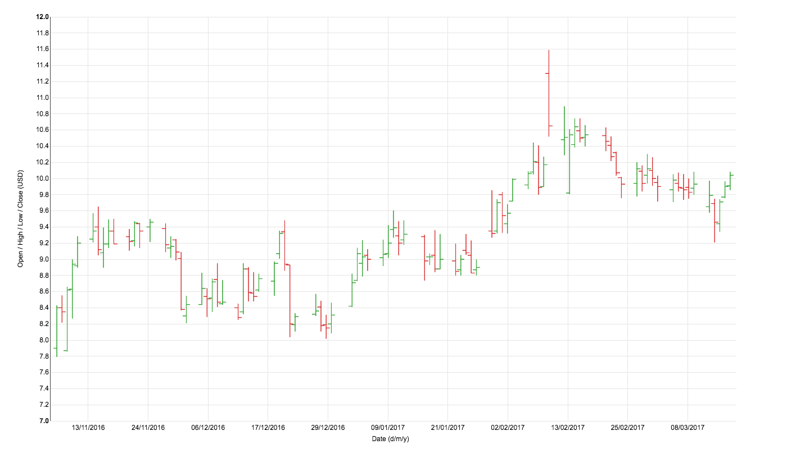

---

## 3.14 Sun Burst Chart


---

#### Test Data

_Input:_

```python
%pyspark
data = [{
    "name": "flare",
    "children": [
        {
            "name": "analytics",
            "children": [
                {
                    "name": "cluster",
                    "children": [
                        {"name": "AgglomerativeCluster", "size": 3938},
                        {"name": "CommunityStructure", "size": 3812},
                        {"name": "HierarchicalCluster", "size": 6714},
                        {"name": "MergeEdge", "size": 743}
                    ]
                },
                {
                    "name": "graph",
                    "children": [
                        {"name": "BetweennessCentrality", "size": 3534},
                        {"name": "LinkDistance", "size": 5731},
                        {"name": "MaxFlowMinCut", "size": 7840},
                        {"name": "ShortestPaths", "size": 5914},
                        {"name": "SpanningTree", "size": 3416}
                    ]
                },
                {
                    "name": "optimization",
                    "children": [
                        {"name": "AspectRatioBanker", "size": 7074}
                    ]
                }
            ]
        },
        {
            "name": "animate",
            "children": [
                {"name": "Easing", "size": 17010},
                {"name": "FunctionSequence", "size": 5842},
                {
                    "name": "interpolate",
                    "children": [
                        {"name": "ArrayInterpolator", "size": 1983},
                        {"name": "ColorInterpolator", "size": 2047},
                        {"name": "DateInterpolator", "size": 1375},
                        {"name": "Interpolator", "size": 8746},
                        {"name": "MatrixInterpolator", "size": 2202},
                        {"name": "NumberInterpolator", "size": 1382},
                        {"name": "ObjectInterpolator", "size": 1629},
                        {"name": "PointInterpolator", "size": 1675},
                        {"name": "RectangleInterpolator", "size": 2042}
                    ]
                },
                {"name": "ISchedulable", "size": 1041},
                {"name": "Parallel", "size": 5176},
                {"name": "Pause", "size": 449},
                {"name": "Scheduler", "size": 5593},
                {"name": "Sequence", "size": 5534},
                {"name": "Transition", "size": 9201},
                {"name": "Transitioner", "size": 19975},
                {"name": "TransitionEvent", "size": 1116},
                {"name": "Tween", "size": 6006}
            ]
        },
        {
            "name": "data",
            "children": [
                {
                    "name": "converters",
                    "children": [
                        {"name": "Converters", "size": 721},
                        {"name": "DelimitedTextConverter", "size": 4294},
                        {"name": "GraphMLConverter", "size": 9800},
                        {"name": "IDataConverter", "size": 1314},
                        {"name": "JSONConverter", "size": 2220}
                    ]
                },
                {"name": "DataField", "size": 1759},
                {"name": "DataSchema", "size": 2165},
                {"name": "DataSet", "size": 586},
                {"name": "DataSource", "size": 3331},
                {"name": "DataTable", "size": 772},
                {"name": "DataUtil", "size": 3322}
            ]
        },
        {
            "name": "display",
            "children": [
                {"name": "DirtySprite", "size": 8833},
                {"name": "LineSprite", "size": 1732},
                {"name": "RectSprite", "size": 3623},
                {"name": "TextSprite", "size": 10066}
            ]
        },
        {
            "name": "flex",
            "children": [
                {"name": "FlareVis", "size": 4116}
            ]
        },
        {
            "name": "physics",
            "children": [
                {"name": "DragForce", "size": 1082},
                {"name": "GravityForce", "size": 1336},
                {"name": "IForce", "size": 319},
                {"name": "NBodyForce", "size": 10498},
                {"name": "Particle", "size": 2822},
                {"name": "Simulation", "size": 9983},
                {"name": "Spring", "size": 2213},
                {"name": "SpringForce", "size": 1681}
            ]
        },
        {
            "name": "query",
            "children": [
                {"name": "AggregateExpression", "size": 1616},
                {"name": "And", "size": 1027},
                {"name": "Arithmetic", "size": 3891},
                {"name": "Average", "size": 891},
                {"name": "BinaryExpression", "size": 2893},
                {"name": "Comparison", "size": 5103},
                {"name": "CompositeExpression", "size": 3677},
                {"name": "Count", "size": 781},
                {"name": "DateUtil", "size": 4141},
                {"name": "Distinct", "size": 933},
                {"name": "Expression", "size": 5130},
                {"name": "ExpressionIterator", "size": 3617},
                {"name": "Fn", "size": 3240},
                {"name": "If", "size": 2732},
                {"name": "IsA", "size": 2039},
                {"name": "Literal", "size": 1214},
                {"name": "Match", "size": 3748},
                {"name": "Maximum", "size": 843},
                {
                    "name": "methods",
                    "children": [
                        {"name": "add", "size": 593},
                        {"name": "and", "size": 330},
                        {"name": "average", "size": 287},
                        {"name": "count", "size": 277},
                        {"name": "distinct", "size": 292},
                        {"name": "div", "size": 595},
                        {"name": "eq", "size": 594},
                        {"name": "fn", "size": 460},
                        {"name": "gt", "size": 603},
                        {"name": "gte", "size": 625},
                        {"name": "iff", "size": 748},
                        {"name": "isa", "size": 461},
                        {"name": "lt", "size": 597},
                        {"name": "lte", "size": 619},
                        {"name": "max", "size": 283},
                        {"name": "min", "size": 283},
                        {"name": "mod", "size": 591},
                        {"name": "mul", "size": 603},
                        {"name": "neq", "size": 599},
                        {"name": "not", "size": 386},
                        {"name": "or", "size": 323},
                        {"name": "orderby", "size": 307},
                        {"name": "range", "size": 772},
                        {"name": "select", "size": 296},
                        {"name": "stddev", "size": 363},
                        {"name": "sub", "size": 600},
                        {"name": "sum", "size": 280},
                        {"name": "update", "size": 307},
                        {"name": "variance", "size": 335},
                        {"name": "where", "size": 299},
                        {"name": "xor", "size": 354},
                        {"name": "_", "size": 264}
                    ]
                },
                {"name": "Minimum", "size": 843},
                {"name": "Not", "size": 1554},
                {"name": "Or", "size": 970},
                {"name": "Query", "size": 13896},
                {"name": "Range", "size": 1594},
                {"name": "StringUtil", "size": 4130},
                {"name": "Sum", "size": 791},
                {"name": "Variable", "size": 1124},
                {"name": "Variance", "size": 1876},
                {"name": "Xor", "size": 1101}
            ]
        },
        {
            "name": "scale",
            "children": [
                {"name": "IScaleMap", "size": 2105},
                {"name": "LinearScale", "size": 1316},
                {"name": "LogScale", "size": 3151},
                {"name": "OrdinalScale", "size": 3770},
                {"name": "QuantileScale", "size": 2435},
                {"name": "QuantitativeScale", "size": 4839},
                {"name": "RootScale", "size": 1756},
                {"name": "Scale", "size": 4268},
                {"name": "ScaleType", "size": 1821},
                {"name": "TimeScale", "size": 5833}
            ]
        },
        {
            "name": "util",
            "children": [
                {"name": "Arrays", "size": 8258},
                {"name": "Colors", "size": 10001},
                {"name": "Dates", "size": 8217},
                {"name": "Displays", "size": 12555},
                {"name": "Filter", "size": 2324},
                {"name": "Geometry", "size": 10993},
                {
                    "name": "heap",
                    "children": [
                        {"name": "FibonacciHeap", "size": 9354},
                        {"name": "HeapNode", "size": 1233}
                    ]
                },
                {"name": "IEvaluable", "size": 335},
                {"name": "IPredicate", "size": 383},
                {"name": "IValueProxy", "size": 874},
                {
                    "name": "math",
                    "children": [
                        {"name": "DenseMatrix", "size": 3165},
                        {"name": "IMatrix", "size": 2815},
                        {"name": "SparseMatrix", "size": 3366}
                    ]
                },
                {"name": "Maths", "size": 17705},
                {"name": "Orientation", "size": 1486},
                {
                    "name": "palette",
                    "children": [
                        {"name": "ColorPalette", "size": 6367},
                        {"name": "Palette", "size": 1229},
                        {"name": "ShapePalette", "size": 2059},
                        {"name": "SizePalette", "size": 2291}
                    ]
                },
                {"name": "Property", "size": 5559},
                {"name": "Shapes", "size": 19118},
                {"name": "Sort", "size": 6887},
                {"name": "Stats", "size": 6557},
                {"name": "Strings", "size": 22026}
            ]
        },
        {
            "name": "vis",
            "children": [
                {
                    "name": "axis",
                    "children": [
                        {"name": "Axes", "size": 1302},
                        {"name": "Axis", "size": 24593},
                        {"name": "AxisGridLine", "size": 652},
                        {"name": "AxisLabel", "size": 636},
                        {"name": "CartesianAxes", "size": 6703}
                    ]
                },
                {
                    "name": "controls",
                    "children": [
                        {"name": "AnchorControl", "size": 2138},
                        {"name": "ClickControl", "size": 3824},
                        {"name": "Control", "size": 1353},
                        {"name": "ControlList", "size": 4665},
                        {"name": "DragControl", "size": 2649},
                        {"name": "ExpandControl", "size": 2832},
                        {"name": "HoverControl", "size": 4896},
                        {"name": "IControl", "size": 763},
                        {"name": "PanZoomControl", "size": 5222},
                        {"name": "SelectionControl", "size": 7862},
                        {"name": "TooltipControl", "size": 8435}
                    ]
                },
                {
                    "name": "data",
                    "children": [
                        {"name": "Data", "size": 20544},
                        {"name": "DataList", "size": 19788},
                        {"name": "DataSprite", "size": 10349},
                        {"name": "EdgeSprite", "size": 3301},
                        {"name": "NodeSprite", "size": 19382},
                        {
                            "name": "render",
                            "children": [
                                {"name": "ArrowType", "size": 698},
                                {"name": "EdgeRenderer", "size": 5569},
                                {"name": "IRenderer", "size": 353},
                                {"name": "ShapeRenderer", "size": 2247}
                            ]
                        },
                        {"name": "ScaleBinding", "size": 11275},
                        {"name": "Tree", "size": 7147},
                        {"name": "TreeBuilder", "size": 9930}
                    ]
                },
                {
                    "name": "events",
                    "children": [
                        {"name": "DataEvent", "size": 2313},
                        {"name": "SelectionEvent", "size": 1880},
                        {"name": "TooltipEvent", "size": 1701},
                        {"name": "VisualizationEvent", "size": 1117}
                    ]
                },
                {
                    "name": "legend",
                    "children": [
                        {"name": "Legend", "size": 20859},
                        {"name": "LegendItem", "size": 4614},
                        {"name": "LegendRange", "size": 10530}
                    ]
                },
                {
                    "name": "operator",
                    "children": [
                        {
                            "name": "distortion",
                            "children": [
                                {"name": "BifocalDistortion", "size": 4461},
                                {"name": "Distortion", "size": 6314},
                                {"name": "FisheyeDistortion", "size": 3444}
                            ]
                        },
                        {
                            "name": "encoder",
                            "children": [
                                {"name": "ColorEncoder", "size": 3179},
                                {"name": "Encoder", "size": 4060},
                                {"name": "PropertyEncoder", "size": 4138},
                                {"name": "ShapeEncoder", "size": 1690},
                                {"name": "SizeEncoder", "size": 1830}
                            ]
                        },
                        {
                            "name": "filter",
                            "children": [
                                {"name": "FisheyeTreeFilter", "size": 5219},
                                {"name": "GraphDistanceFilter", "size": 3165},
                                {"name": "VisibilityFilter", "size": 3509}
                            ]
                        },
                        {"name": "IOperator", "size": 1286},
                        {
                            "name": "label",
                            "children": [
                                {"name": "Labeler", "size": 9956},
                                {"name": "RadialLabeler", "size": 3899},
                                {"name": "StackedAreaLabeler", "size": 3202}
                            ]
                        },
                        {
                            "name": "layout",
                            "children": [
                                {"name": "AxisLayout", "size": 6725},
                                {"name": "BundledEdgeRouter", "size": 3727},
                                {"name": "CircleLayout", "size": 9317},
                                {"name": "CirclePackingLayout", "size": 12003},
                                {"name": "DendrogramLayout", "size": 4853},
                                {"name": "ForceDirectedLayout", "size": 8411},
                                {"name": "IcicleTreeLayout", "size": 4864},
                                {"name": "IndentedTreeLayout", "size": 3174},
                                {"name": "Layout", "size": 7881},
                                {"name": "NodeLinkTreeLayout", "size": 12870},
                                {"name": "PieLayout", "size": 2728},
                                {"name": "RadialTreeLayout", "size": 12348},
                                {"name": "RandomLayout", "size": 870},
                                {"name": "StackedAreaLayout", "size": 9121},
                                {"name": "TreeMapLayout", "size": 9191}
                            ]
                        },
                        {"name": "Operator", "size": 2490},
                        {"name": "OperatorList", "size": 5248},
                        {"name": "OperatorSequence", "size": 4190},
                        {"name": "OperatorSwitch", "size": 2581},
                        {"name": "SortOperator", "size": 2023}
                    ]
                },
                {"name": "Visualization", "size": 16540}
            ]
        }
    ]
}]
```


---


_Input:_

```python
%pyspark
#!zeppelin2md:images/sunBurstChart-050.png

sb = nv.sunBurstChart()

config = {"height":800}
sb.plot({"data":data, "config":config})
```


_Result:_

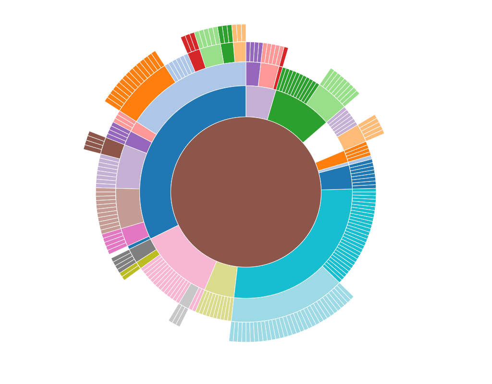

---


_Input:_

```python
%pyspark


cs.saveAsPng(chart=0)
```


---


_Input:_

```python
%pyspark
```

