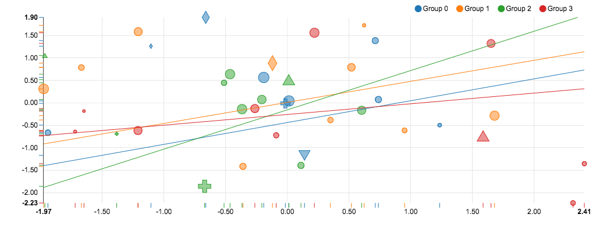
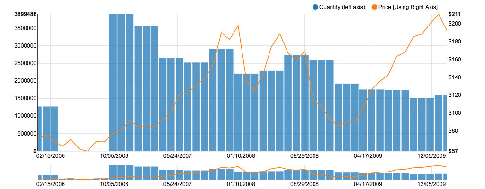

>**Note:**
>This Readme has been automatically created by [zepppelin2md.py](https://github.com/bernhard-42/zeppelin2md).

>Alternatively, load into your Zeppelin instance using the URL 
>    `https://raw.githubusercontent.com/bernhard-42/zeppelin-visualizations/master/notebooks/Zeppelin-Viz.json`

# notebooks/Zeppelin-Viz.json

---


_Input:_

```python
%pyspark

def versionCheck():
    import sys
    print("Python: " + sys.version.replace("\n", " - "))
    print("Spark:  " + sc.version)

def display(html):
    print("%angular")
    print(html)

def getNoteId():
    return z.z.getInterpreterContext().getNoteId()

def getParagraphId():
    return z.z.getInterpreterContext().getParagraphId()


# The variable z holds the zeppelinContext. It is essential for all Angular based interactions - so let's save it :-)
ZEPPELIN_CONTEXT = z.z

# In case one overwrites z, z = recoverZeppelinContext() gets the context back
def recoverZeppelinContext():
    return PyZeppelinContext(ZEPPELIN_CONTEXT)

versionCheck()
```


---

#### Initialize ZeppelinSession ...

_Input:_

```python
%pyspark

from zeppelin_session import ZeppelinSession, resetZeppelinSession, LogLevel, Logger

# resetZeppelinSession(z.z)

# LogLevel().setLogLevel("DEBUG")

zs = ZeppelinSession(z.z)
```


---

#### ... and start it in the next paragraph

_Input:_

```python
%pyspark

zs.start()
```


---

## 1 NVD3


see [http://nvd3.org/](http://nvd3.org/)


---


_Input:_

```python
%pyspark

from zeppelin_viz.nvd3 import Nvd3

nv = Nvd3()
```


---


_Input:_

```python
%pyspark
#!zeppelin2md:images/scatter.gif

import numpy as np
import random

def randomData(groups, points): # number of groups and number of points per group
    data = []
    shapes = ['cross', 'triangle-up', 'triangle-down', 'diamond', 'square']
    
    return [{"key":      "Group %d" % i, 
             "values":   [{"x":     np.random.normal(0, 1, 1).item(0), 
                           "y":     np.random.normal(0, 1, 1).item(0),
                           "size":  random.random(),
                           "shape": shapes[j % 5] if (random.random() > 0.8) else "circle"} for j in range(points)],
             "slope":     random.random() - 0.01,
             "intercept": random.random() - 0.5} for i in range(groups)]
 
spl = nv.scatterPlusLineChart()
spl.plot(randomData(4,10))
```


_Result:_



---


_Input:_

```python
%pyspark
spl.append(randomData(4,5))
```


---


_Input:_

```python
%pyspark
spl.saveAsPng("scatter")
```


---


_Input:_

```python
%pyspark

import pandas as pd
quantity =  [ 
        [ 1136005200000 , 1271000.0] , [ 1138683600000 , 1271000.0] , [ 1141102800000 , 1271000.0] , [ 1143781200000 , 0] , [ 1146369600000 , 0] , [ 1149048000000 , 0] , 
        [ 1151640000000 , 0] , [ 1154318400000 , 0] , [ 1156996800000 , 0] , [ 1159588800000 , 3899486.0] , [ 1162270800000 , 3899486.0] , [ 1164862800000 , 3899486.0] , [ 1167541200000 , 3564700.0] , 
        [ 1170219600000 , 3564700.0] , [ 1172638800000 , 3564700.0] , [ 1175313600000 , 2648493.0] , [ 1177905600000 , 2648493.0] , [ 1180584000000 , 2648493.0] , [ 1183176000000 , 2522993.0] , 
        [ 1185854400000 , 2522993.0] , [ 1188532800000 , 2522993.0] , [ 1191124800000 , 2906501.0] , [ 1193803200000 , 2906501.0] , [ 1196398800000 , 2906501.0] , [ 1199077200000 , 2206761.0] , 
        [ 1201755600000 , 2206761.0] , [ 1204261200000 , 2206761.0] , [ 1206936000000 , 2287726.0] , [ 1209528000000 , 2287726.0] , [ 1212206400000 , 2287726.0] , [ 1214798400000 , 2732646.0] , 
        [ 1217476800000 , 2732646.0] , [ 1220155200000 , 2732646.0] , [ 1222747200000 , 2599196.0] , [ 1225425600000 , 2599196.0] , [ 1228021200000 , 2599196.0] , [ 1230699600000 , 1924387.0] , 
        [ 1233378000000 , 1924387.0] , [ 1235797200000 , 1924387.0] , [ 1238472000000 , 1756311.0] , [ 1241064000000 , 1756311.0] , [ 1243742400000 , 1756311.0] , [ 1246334400000 , 1743470.0] , 
        [ 1249012800000 , 1743470.0] , [ 1251691200000 , 1743470.0] , [ 1254283200000 , 1519010.0] , [ 1256961600000 , 1519010.0] , [ 1259557200000 , 1519010.0] , [ 1262235600000 , 1591444.0] , 
        [ 1264914000000 , 1591444.0] , [ 1267333200000 , 1591444.0] , [ 1270008000000 , 1543784.0] , [ 1272600000000 , 1543784.0] , [ 1275278400000 , 1543784.0] , [ 1277870400000 , 1309915.0] , 
        [ 1280548800000 , 1309915.0] , [ 1283227200000 , 1309915.0] , [ 1285819200000 , 1331875.0] , [ 1288497600000 , 1331875.0] , [ 1291093200000 , 1331875.0] , [ 1293771600000 , 1331875.0] , 
        [ 1296450000000 , 1154695.0] , [ 1298869200000 , 1154695.0] , [ 1301544000000 , 1194025.0] , [ 1304136000000 , 1194025.0] , [ 1306814400000 , 1194025.0] , [ 1309406400000 , 1194025.0] , 
        [ 1312084800000 , 1194025.0] , [ 1314763200000 , 1244525.0] , [ 1317355200000 , 475000.0] , [ 1320033600000 , 475000.0] , [ 1322629200000 , 475000.0] , [ 1325307600000 , 690033.0] , 
        [ 1327986000000 , 690033.0] , [ 1330491600000 , 690033.0] , [ 1333166400000 , 514733.0] , [ 1335758400000 , 514733.0]
    ]

price =  [ 
        [ 1136005200000 , 71.89] , [ 1138683600000 , 75.51] , [ 1141102800000 , 68.49] , [ 1143781200000 , 62.72] , [ 1146369600000 , 70.39] , [ 1149048000000 , 59.77] , 
        [ 1151640000000 , 57.27] , [ 1154318400000 , 67.96] , [ 1156996800000 , 67.85] , [ 1159588800000 , 76.98] , [ 1162270800000 , 81.08] , [ 1164862800000 , 91.66] , [ 1167541200000 , 84.84] , 
        [ 1170219600000 , 85.73] , [ 1172638800000 , 84.61] , [ 1175313600000 , 92.91] , [ 1177905600000 , 99.8] , [ 1180584000000 , 121.191] , [ 1183176000000 , 122.04] , [ 1185854400000 , 131.76] , 
        [ 1188532800000 , 138.48] , [ 1191124800000 , 153.47] , [ 1193803200000 , 189.95] , [ 1196398800000 , 182.22] , [ 1199077200000 , 198.08] , [ 1201755600000 , 135.36] , [ 1204261200000 , 125.02] , 
        [ 1206936000000 , 143.5] , [ 1209528000000 , 173.95] , [ 1212206400000 , 188.75] , [ 1214798400000 , 167.44] , [ 1217476800000 , 158.95] , [ 1220155200000 , 169.53] , [ 1222747200000 , 113.66] , 
        [ 1225425600000 , 107.59] , [ 1228021200000 , 92.67] , [ 1230699600000 , 85.35] , [ 1233378000000 , 90.13] , [ 1235797200000 , 89.31] , [ 1238472000000 , 105.12] , [ 1241064000000 , 125.83] , 
        [ 1243742400000 , 135.81] , [ 1246334400000 , 142.43] , [ 1249012800000 , 163.39] , [ 1251691200000 , 168.21] , [ 1254283200000 , 185.35] , [ 1256961600000 , 188.5] , [ 1259557200000 , 199.91] , 
        [ 1262235600000 , 210.732] , [ 1264914000000 , 192.063] , [ 1267333200000 , 204.62] , [ 1270008000000 , 235.0] , [ 1272600000000 , 261.09] , [ 1275278400000 , 256.88] , [ 1277870400000 , 251.53] , 
        [ 1280548800000 , 257.25] , [ 1283227200000 , 243.1] , [ 1285819200000 , 283.75] , [ 1288497600000 , 300.98] , [ 1291093200000 , 311.15] , [ 1293771600000 , 322.56] , [ 1296450000000 , 339.32] , 
        [ 1298869200000 , 353.21] , [ 1301544000000 , 348.5075] , [ 1304136000000 , 350.13] , [ 1306814400000 , 347.83] , [ 1309406400000 , 335.67] , [ 1312084800000 , 390.48] , [ 1314763200000 , 384.83] , 
        [ 1317355200000 , 381.32] , [ 1320033600000 , 404.78] , [ 1322629200000 , 382.2] , [ 1325307600000 , 405.0] , [ 1327986000000 , 456.48] , [ 1330491600000 , 542.44] , [ 1333166400000 , 599.55] , 
        [ 1335758400000 , 583.98] 
    ]
    
qDf = pd.DataFrame([{"Date":r[0], "Quantity":r[1]} for r in quantity])
pDf = pd.DataFrame([{"Date":r[0], "Price":r[1]} for r in price])
df = pd.merge(pDf, qDf, on="Date")
df.head()
```


---


_Input:_

```python
%pyspark
#!zeppelin2md:images/bar-line.gif

lpb = nv.linePlusBarChart()

data = lpb.convert(df.iloc[0:50, :], "Date", line="Price", bar="Quantity")
lpb.plot(data)
```


_Result:_



---


_Input:_

```python
%pyspark

import time

for i in range(50, 77, 5):
    lpb.append(lpb.convert(df.iloc[i:i+5,:], "Date", line="Price", bar="Quantity"))
    time.sleep(0.1)
```


---


_Input:_

```python
%pyspark
lpb.saveAsPng("bar-line")
```


---


## 2 Bokeh

see [http://bokeh.pydata.org/](http://bokeh.pydata.org/)


---


_Input:_

```python
%pyspark

from zeppelin_comm_layer import ZeppelinCommLayer, LogLevel

LogLevel().setLogLevel("DEBUG")
zcl = ZeppelinCommLayer(z.z)
```


---


_Input:_

```python
%pyspark
zcl.start()
```


---


_Input:_

```python
%pyspark

import zeppelin_viz

from zeppelin_viz.bokeh import BokehStates

BokehStates(z.z).initState()
```


---


_Input:_

```python
%pyspark

from bokeh.io import push_notebook, show, output_notebook
from bokeh.layouts import row
from bokeh.resources import Resources
from bokeh.plotting import figure

output_notebook()
```


---


_Input:_

```python
%pyspark
#!zeppelin2md:images/bokeh-1.gif

opts = dict(plot_width=250, plot_height=250, min_border=0)
p1 = figure(**opts)
r1 = p1.circle([1,2,3], [4,5,6], size=20)

p2 = figure(**opts)
r2 = p2.circle([1,2,3], [4,5,6], size=20)

handle1 = show(row(p1, p2), notebook_handle=True)
```


_Result:_


---


_Input:_

```python
%pyspark

r1.glyph.fill_color = "yellow"
r2.glyph.fill_color = "orange"

push_notebook(handle=handle1)
```


---


_Input:_

```python
%pyspark
print("%html")
print("""<script src="http://cdn.rawgit.com/exupero/saveSvgAsPng/gh-pages/saveSvgAsPng.js" type="text/javascript"></script>""")
```


---


_Input:_

```python
%pyspark
```

