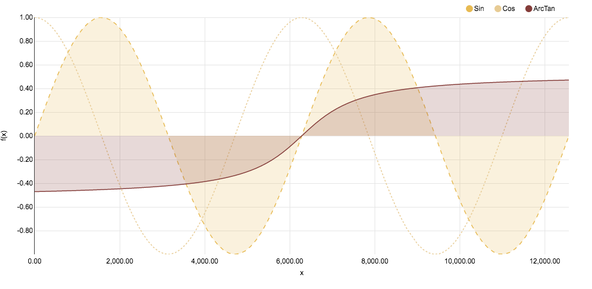

>**Note:**
>This Readme has been automatically created by [zepppelin2md.py](https://github.com/bernhard-42/zeppelin2md).

>Alternatively, load into your Zeppelin instance using the URL 
>    `https://raw.githubusercontent.com/bernhard-42/zeppelin-visualizations/master/notebooks/Zeppelin-Viz.json`

# notebooks/Zeppelin-Viz.json

---


_Input:_

```python
%pyspark

def versionCheck():
    import sys
    print("Python: " + sys.version.replace("\n", " - "))
    print("Spark:  " + sc.version)

def display(html, style=None):
    print("%angular")
    if isinstance(html, (tuple, list)):
        html = "".join(["""<div style="display:inline; margin-left:%dpx">%s</div>""" % (el[1], el[0]) for el in html])
    if style is not None:
        html = "<%s>%s</%s>" % (style, html, style)
    print(html)

def getNoteId():
    return z.z.getInterpreterContext().getNoteId()

def getParagraphId():
    return z.z.getInterpreterContext().getParagraphId()


# The variable z holds the zeppelinContext. It is essential for all Angular based interactions - so let's save it :-)
ZEPPELIN_CONTEXT = z.z

# In case one overwrites z, z = recoverZeppelinContext() gets the context back
def recoverZeppelinContext():
    return PyZeppelinContext(ZEPPELIN_CONTEXT)

versionCheck()
```


_Result:_

```
Python: 3.5.2 |Anaconda 4.3.0 (x86_64)| (default, Jul  2 2016, 17:52:12)  - [GCC 4.2.1 Compatible Apple LLVM 4.2 (clang-425.0.28)]
Spark:  2.1.0

```

---

#### Initialize ZeppelinSession ...

_Input:_

```python
%pyspark

from zeppelin_session import ZeppelinSession, resetZeppelinSession, LogLevel, Logger

resetZeppelinSession(z.z)
# LogLevel().setLogLevel("DEBUG")

zs = ZeppelinSession(z.z)
```


_Result:_

```
Resetting ZeppelinSession

```

---

#### ... and start it in the next paragraph

_Input:_

```python
%pyspark

zs.start()
```


---

## 1 NVD3


see [http://nvd3.org/](http://nvd3.org/)


---


_Input:_

```python
%pyspark

from zeppelin_viz.nvd3 import Nvd3

nv = Nvd3()
```


---

#### Recommend to use NVD3 1.8.5 (note this might break %sql visualizations)

_Input:_

```python
%pyspark
nv.reloadNVD3("1.8.5")
```


---


_Input:_

```python
%pyspark

x = np.linspace(0, 4*np.pi, 100)

df = pd.DataFrame({"X":x*1000, "Sin":np.sin(x), "Cos":np.cos(x), "ArcTan":np.arctan(x-2*np.pi)/3})
df.head()
```


---


_Input:_

```python
%pyspark
#!zeppelin2md:images/lineChart-035.png

l = nv.lineChart()

config={"height":500, "width": 1024,
        "focusEnable": False, "color":nv.c20b()[10:13], 
        "yAxis": {"axisLabel":"f(x)", "tickFormat":",.2f"}, 
        "xAxis":{"axisLabel":"x", "tickFormat":",.2f"}}
        
lineAttributes={"area":[True, False, True], "fillOpacity":[0.2, 0, 0.2], "style":["dashed", "dotted", None]}

data = l.convert(data=l_df[:70], key="X", values=["Sin", "Cos", "ArcTan"],lineAttributes=lineAttributes)        

l.plot({"data":data, "config":config})
```


_Result:_



---

#### Dynamically add data

_Input:_

```python
%pyspark

import time

for i in range(71,100):
    time.sleep(0.1)
    data = l.convert(data=l_df[i:i+1], key="X", values=["Sin", "Cos", "ArcTan"], lineAttributes=lineAttributes)
    l.append({"data":data, "config":config})
```


---

#### The Javascript part

_Input:_

```python
%pyspark
print(l.funcBody)
```


---


## 2 Bokeh

see [http://bokeh.pydata.org/](http://bokeh.pydata.org/)


---


_Input:_

```python
%pyspark

from zeppelin_comm_layer import ZeppelinCommLayer, LogLevel

LogLevel().setLogLevel("DEBUG")
zcl = ZeppelinCommLayer(z.z)
```


---


_Input:_

```python
%pyspark
zcl.start()
```


---


_Input:_

```python
%pyspark

import zeppelin_viz

from zeppelin_viz.bokeh import BokehStates

BokehStates(z.z).initState()
```


---


_Input:_

```python
%pyspark

from bokeh.io import push_notebook, show, output_notebook
from bokeh.layouts import row
from bokeh.resources import Resources
from bokeh.plotting import figure

output_notebook()
```


---


_Input:_

```python
%pyspark
#!zeppelin2md:images/bokeh-1.gif

opts = dict(plot_width=250, plot_height=250, min_border=0)
p1 = figure(**opts)
r1 = p1.circle([1,2,3], [4,5,6], size=20)

p2 = figure(**opts)
r2 = p2.circle([1,2,3], [4,5,6], size=20)

handle1 = show(row(p1, p2), notebook_handle=True)
```


_Result:_


---


_Input:_

```python
%pyspark

r1.glyph.fill_color = "yellow"
r2.glyph.fill_color = "orange"

push_notebook(handle=handle1)
```


---


_Input:_

```python
%pyspark
```

